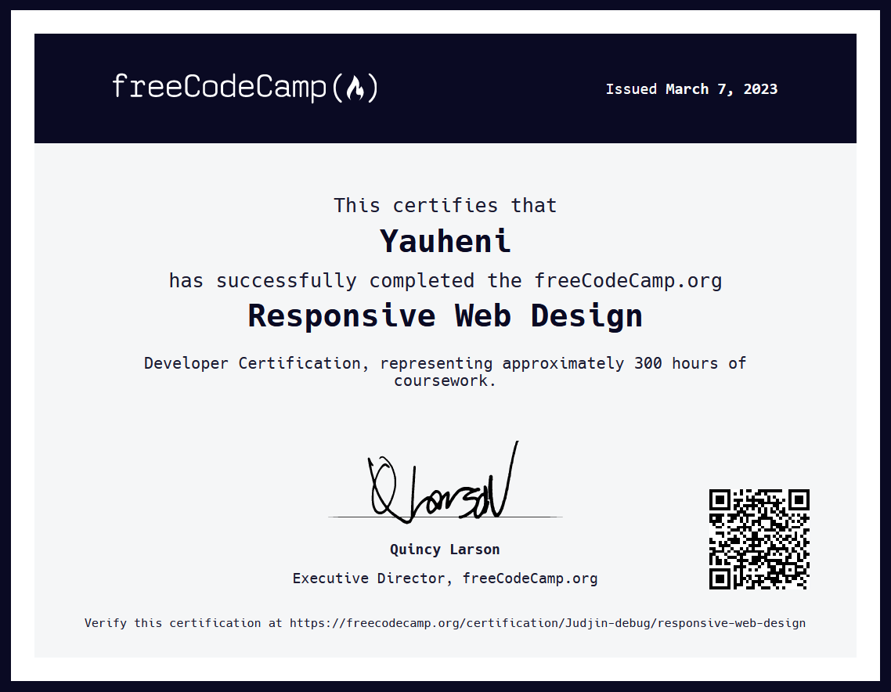
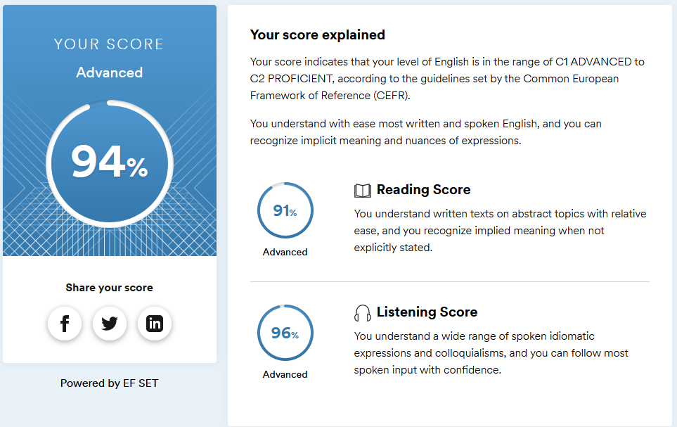

# [rsschool-cv](https://judjin-debug.github.io/rsschool-cv/cv)
# Yauheni Najaran
### Frontend trainee
---
### Contacts:
**Phone:** +375 (29) 319-65-79\
**E-mail:** yauheniN27@protonmail.com\
**Telegram:** @Yauheni_J\
[LinkedIn](https://www.linkedin.com/in/yauheni-najaran-bb833a228/)
---
### Little bio:
I'm a graduate from BSU Mechanics and Mathematics faculty. I finished it
because of having a passion for mathematics. Before attending university, 
I had C1 english proficiency level.

I wanted to try working in a programming job since my student years since 
I was half-decent at programming, too. I used to work with Pascal,
HTML/CSS/JS, MatLab, Wolfram Mathematica and with DB language (notably also
numerical methods / numerical analysis for more mathematics-oriented problems). 
I also tried CodeWars  kata challenge, earning 3 kyu rank in just a week or so.

After 2.5 years of working as a teacher to pay off my academic debt, I tried to 
involve myself in programming. I still only have the most superficial 
understanding of what the job market wants from me after 2 years.
---

### Instruments, libraries and skills:
* HTML, CSS, JS
* Java (lambda, streams API, patterns, reflection API)
* Spring Boot and Hibernate
* Python (django, plotly, seaborn, pandas, matplotlib, numpy)
* Git, GitHub
* SQL (PostgreSQL)
* VSCode, IntelliJ IDEA, PyCharm, pgAdmin 4, DBeaver, redis
* Google cloud platform
* Matlab
---
### Code example:
**Karnaugh's detonating timer (a k-map primer):**

You isolated from the circuit the three wires (b2, b1 and b0) used to represent the units above 9, and wish to use them to light up the correct segments so to display the A to F letters:
```
   b2  b1  b0
A  0   0   0
B  0   0   1
C  0   1   0
D  0   1   1
E  1   0   0
F  1   0   1
```
We will number the segments of the display as follows: 
```
     1
    ───
2  │   │ 3
    ───   4
5  │   │ 6
    ───
     7
```
So, for example, if needed to display 'A' (that means all b2, b1 and b0 off), segments 1, 2, 3, 4, 5 and 6 must be lit; for 'B' (only b0 on), all segments must be turned on; for 'D' (b1 and b0 on), all segments but the one numbered 4 should be lit.

JavaScript:
```
var segments = [
  function segment1(b2, b1, b0) { return 1},
  function segment2(b2, b1, b0) { return 1},
  function segment3(b2, b1, b0) { return (!b2&!b1&!b0)|(b0&!b2)},
  function segment4(b2, b1, b0) { return b2|!b1},
  function segment5(b2, b1, b0) { return 1},
  function segment6(b2, b1, b0) { return (!b2&!b1&!b0)|(b0&!b2)},
  function segment7(b2, b1, b0) { return  (b2|b1|b0)&(!b2|b1|!b0)}
  ];
```
---
### Courses:
* freeCodeCamp HTML & CSS course:
  
---
### Languages:
* English - Advanced/Proficient (according to the test at www.efset.org)
  
* Russian - Basic (native)
